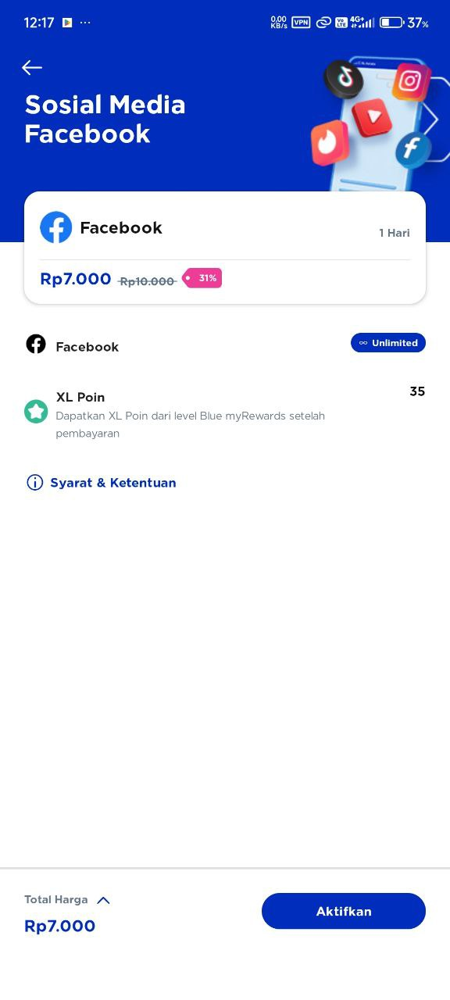
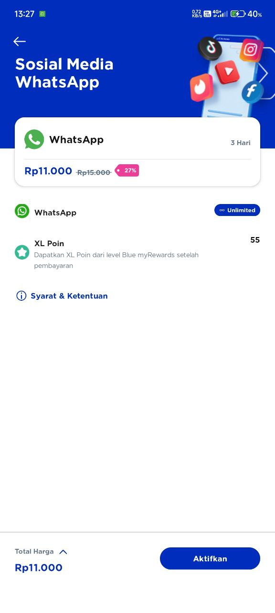
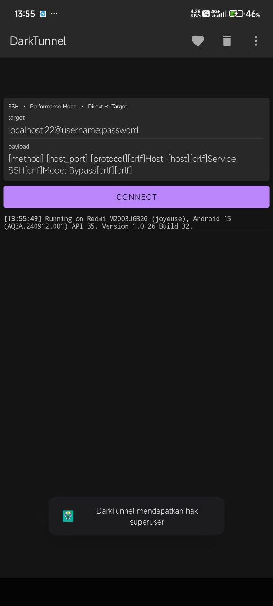
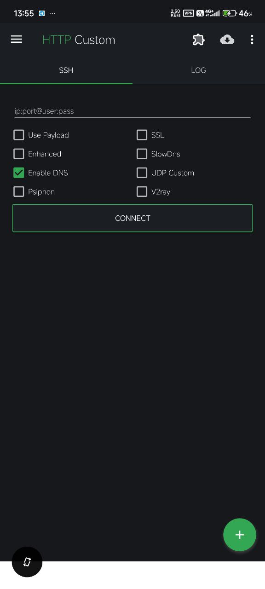

 # SuntikPaket
SuntikPaket adalah bagaimana cara nya agar kita bisa menggunakan paket data tanpa mengikuti syarat dan ketentuan provider.

Dari sekian banyak provider, untuk saat ini saya merekomendasikan simcard XL, kenapa? karna XL banyak menawarkan paket unlimited ,seperti unlimited Instagram,Whatsapp,Tiktok,Vidio,Facebook dll.
## Screenshot

***
Apabila kita mengikuti syarat dan ketentuan paket tersebut makan kita hanya bisa menggunakan kuota untuk aplikasi yang tertera. Nah tujuan dari SuntikPaket ini adalah bagaimana cara nya agar paket tersebut bisa di gunakan untuk semua aplikasi atau web layaknya kuota reguler. 
## Persiapan
* Hal pertama yang harus kita miliki adalah Simcard (saya rekomendasikan XL).
* Paket data yang di beli, untuk paket data saya sarankan membeli paket unlimited bulanan.
* Aplikasi untuk SuntikPaket banyak tersedia di playtore seeperti HTTP Custom,Dark Tunnel,Net Mod dll.
* Dan yang terahir file configurasi untuk aplikasi SuntikPaket.
***
Untuk pilihan aplikasi SuntikPaket dari sekian banyak yang paling ringan adalah Dark Tunnel,tapi kalo untuk fleksibilitas yang paling cocok untuk berbagai merk HP adalah HTTP Custom (saya sarankan pilih HTTP Custom).
## Screenshot

***
Untuk cara penggunaan HTTP Custom silahkan buka link di bawah

[Open Youtube](https://youtube.com/shorts/i4cH9ZSFHBA?si=1yWoyn1rl-2Zts7f)

