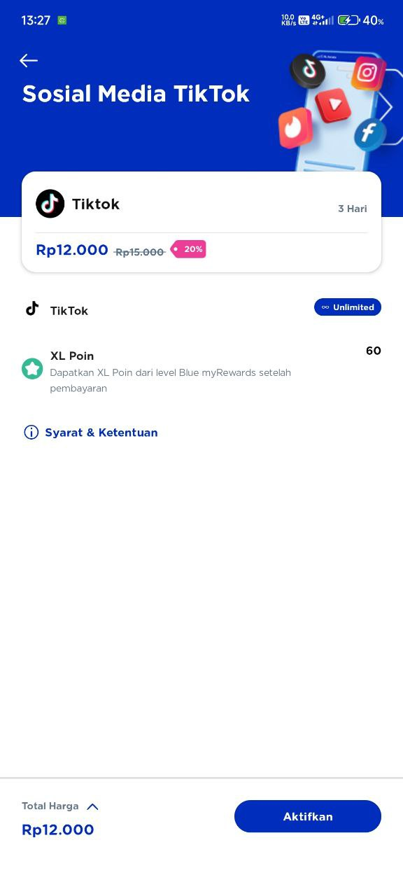

 <h1 align="center">SuntikPaket</h1>
SuntikPaket adalah bagaimana cara nya agar kita bisa menggunakan paket data tanpa mengikuti syarat dan ketentuan provider.

Dari sekian banyak provider, untuk saat ini saya merekomendasikan simcard XL, kenapa? karna XL banyak menawarkan paket unlimited ,seperti unlimited Instagram,Whatsapp,Tiktok,Vidio,Facebook dll.
## Screenshot

***
Apabila kita mengikuti syarat dan ketentuan paket tersebut maka kita hanya bisa menggunakan kuota untuk aplikasi yang tertera. Nah tujuan dari SuntikPaket ini adalah bagaimana cara nya agar paket tersebut bisa di gunakan untuk semua aplikasi atau web layaknya kuota reguler. 
## Persiapan
* Hal pertama yang harus kita miliki adalah Simcard (saya rekomendasikan XL).
* Paket data yang di beli, untuk paket data saya sarankan membeli paket unlimited bulanan Beli Di [SuntikPaket](https://wa.me/6285864048253).
* Aplikasi untuk SuntikPaket banyak tersedia di playtore seeperti [HTTP Custom](https://play.google.com/store/apps/details?id=xyz.easypro.httpcustom),[Dark Tunnel](https://play.google.com/store/apps/details?id=net.darktunnel.app),Net Mod dll.
* Dan yang terakhir file configurasi (biasanya ukuran file kurang dari 5kb) untuk aplikasi SuntikPaket beli di [SuntikPaket](https://wa.me/6285864048253) .
***
Untuk pilihan aplikasi SuntikPaket dari sekian banyak yang paling ringan adalah Dark Tunnel,tapi kalo untuk fleksibilitas yang paling cocok untuk berbagai merk HP adalah HTTP Custom (saya sarankan pilih [HTTP Custom](https://play.google.com/store/apps/details?id=xyz.easypro.httpcustom)).
## Screenshot

***
## Cara Penggunaan (simple)
Untuk cara penggunaan HTTP Custom silahkan buka link di bawah

[Open Youtube](https://youtube.com/shorts/i4cH9ZSFHBA?si=1yWoyn1rl-2Zts7f)

***
## Kelebihan paket
* Harga jauh lebih Murah.
* Support Hostpot dari android ke android ,atau dari android ke Leptop/pc.
* Kecepatan paket data mendekati paket reguler (paket biasa).
***
## Kekurangan Paket
* Harus selalu mengggunakan bantuan aplikasi agar terhubung ke internet seperti [HTTP Custom](https://play.google.com/store/apps/details?id=xyz.easypro.httpcustom).
* Ada kemungkinan paket internet Unofficial yang di beli akan di suspend (DI NONAKTIFKAN) oleh provider sehingga tidak dapat di gunakan, berbeda dengan paket data official (dari myxl) di pastikan aman,dan ini di luar kendali admin (tidak bisa di perbaiki).
* Ada kendala tak terduga di file configurasi di sebabkan bug paket yang mati, atau server vps yang gangguan sehingga keduanya menyebabkan [HTTP Custom](https://play.google.com/store/apps/details?id=xyz.easypro.httpcustom) tidak dapat terhubung ke internet,ini masih dalam kendali admin (bisa di perbaiki).

